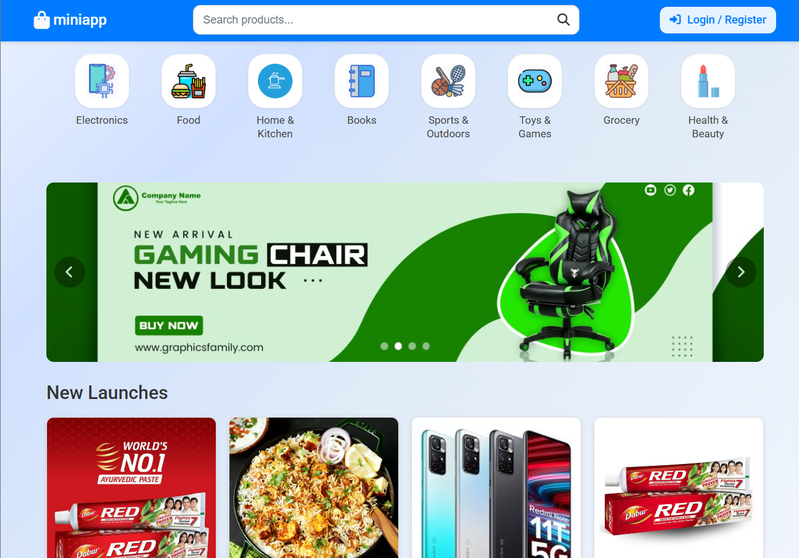

# Professional E-commerce Application



A full-featured, responsive e-commerce web application built with Node.js, Express, and MongoDB. Customers can browse products, make purchases, and both administrators and sellers can manage the store with dedicated dashboards.

**Live Demo:** [miniappecom.vercel.app](https://miniappecom.vercel.app/)

**GitHub Repo:** [nallamothusurya/surya-ecommerce](https://github.com/ayyappavenkatasurya/surya-ecommerce)

---

## 🚀 Features

### 🛒 User Shopping Experience
- **Responsive Design:** Works seamlessly on both desktop & mobile.
- **Product Discovery:** Browse, search, and filter products.
- **Product Details:** Images, descriptions, and customer ratings.
- **Secure Auth:** Register/login (local + Google OAuth).
- **Shopping Cart:** Add, update, and remove items.
- **Checkout:** Pay via Razorpay or Cash on Delivery (COD).
- **User Profile:** Order history & address management.

### 🛠️ Admin Panel
- **Dashboard:** Site statistics and analytics.
- **Product Management:** Full CRUD for products.
- **Order Management:** Track and update any order.
- **User Management:** Role assignments and user controls.
- **Banner Management:** Homepage banners control.

### 🏪 Seller Dashboard
- **Product Listings:** Manage own products.
- **Order Management:** Handle orders specific to seller's products.
- **Data Isolation:** Sellers only access their own data.

### 🔒 Backend & Security
- **Node.js & Express:** Modern backend stack.
- **MongoDB & Mongoose:** Flexible, scalable data modeling.
- **Session Management:** Secure sessions and cookies.
- **Rate Limiting:** Protection against abuse.
- **Password Hashing:** User data protection.

---

## 📸 Screenshot


---

## ⚙️ Technologies Used

- **Frontend:** HTML5, CSS3, JavaScript (responsive)
- **Backend:** Node.js, Express.js
- **Database:** MongoDB, Mongoose
- **Authentication:** Passport.js (local & Google OAuth)
- **Payments:** Razorpay integration
- **Other:** RESTful API, JWT, session/cookie management

---

## 🏁 Getting Started

### Prerequisites

- Node.js & npm
- MongoDB database
- Razorpay account (for payment integration)
- Google OAuth credentials (optional)

### Installation

1. **Clone the repository:**
   ```bash
   git clone https://github.com/nallamothusurya/surya-ecommerce.git
   cd surya-ecommerce
   ```

2. **Install dependencies:**
   ```bash
   npm install
   ```

3. **Configure environment variables:**
   - Create a `.env` file in the root directory.
   - Add variables for MongoDB URI, JWT secret, Razorpay keys, Google OAuth, etc.

4. **Start the application:**
   ```bash
   npm start
   ```
   The app will run on `http://localhost:3000` by default.

---

## 👤 User Roles

- **Customer:** Browse and shop products.
- **Seller:** Manage own products and orders.
- **Admin:** Full access to all management features.

---

## 📝 License

This project is licensed under the MIT License.

---

## 🤝 Contributing

Contributions are welcome! Please open issues or submit pull requests.

---

## 📧 Contact

For questions or support, please open an issue or email [ayyappanallamothu4@gmail.com](mailto:ayyappanallamothu4@gmail.com).
